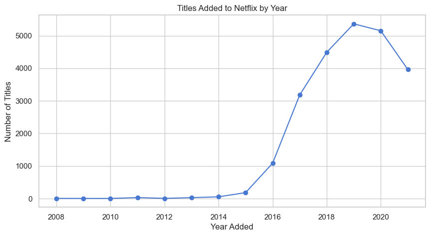
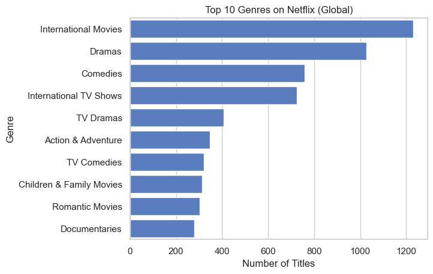
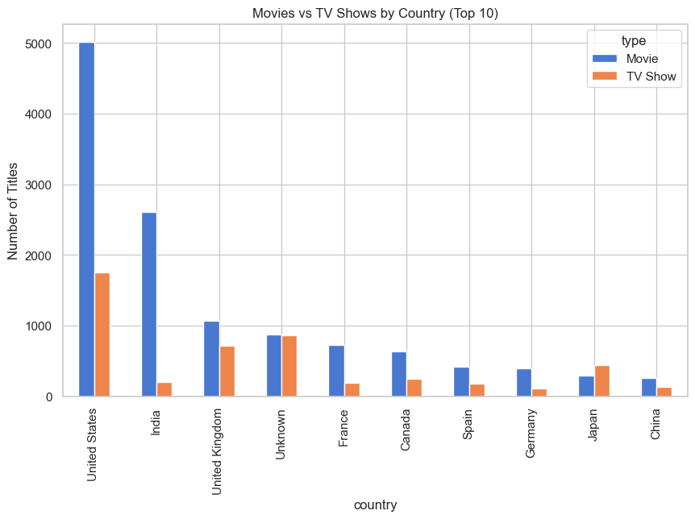
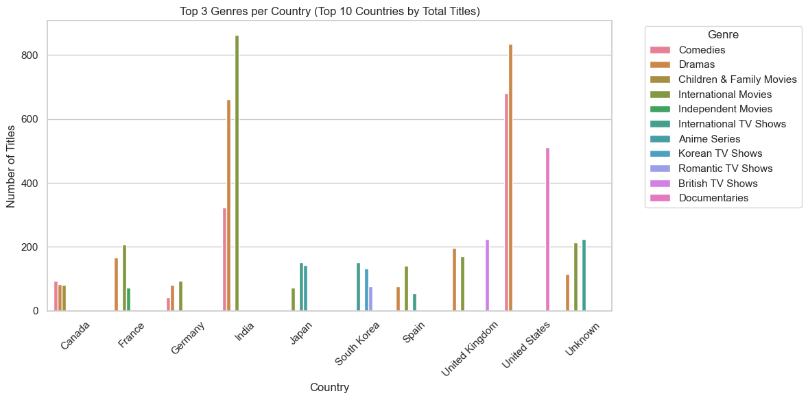
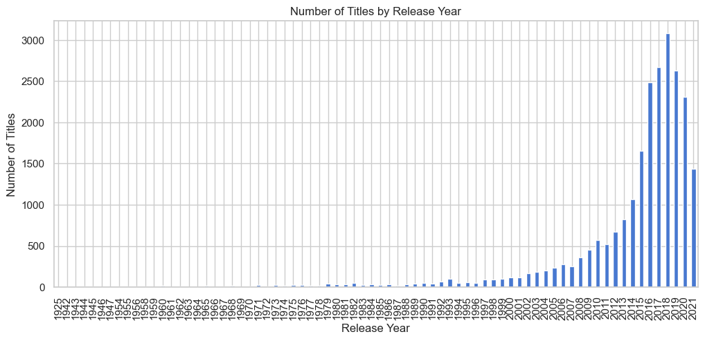
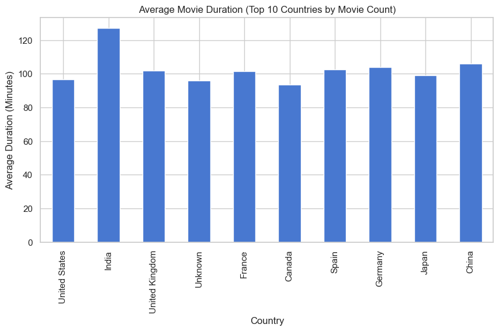
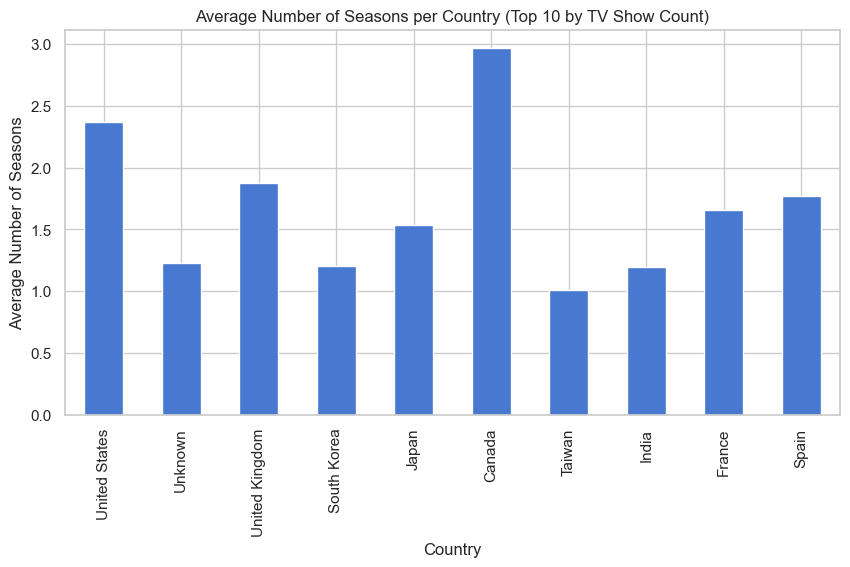

# Netflix Data Analysis

## Overview
This project performs exploratory data analysis (EDA) on Netflix’s content catalog to identify trends in content type, genres, release years, ratings, and country of production.

## Tools & Technologies
- Python (Pandas, Matplotlib, Seaborn)
- Jupyter Notebook
- CSV dataset

## Dataset
- File: `netflix_titles.csv`
- Records: ~8,800 Netflix titles
- Key fields: title, type, country, release_year, rating, listed_in, duration

## Key Questions Explored
- How has Netflix content grown over time?
- What is the distribution between Movies and TV Shows?
- Which genres appear most frequently?
- Which countries produce the most Netflix content?
- How are titles distributed across ratings?

## Key Insights
- Netflix content increased rapidly after 2015
- Movies in India and TV Shows in Canada have a much longer durations(minutes and seasons)
- Comedy and Drama related genres dominate the catalog
- The United States and India are the top content producers

## Visualizations
### Content Growth Over Time


### Top Genres


### Movies vs TV Shows


### Country Distribution


### Popular Release years


### Duration Analysis



## Project Structure
```
netflix_python_project/
  data/
    netflix_titles.csv
  notebooks/
    netflix_eda.ipynb
  visualizations/
    genre_by_country.png
    movie_duration.png
    movies_vs_shows.png
    show_duration.png
    title_added.png
    titles_release_year.png
    top_genres.png
```
## What I Learned
- Cleaning and preprocessing real-world datasets
- Conducting exploratory data analysis in Python
- Creating visualizations to communicate insights
- Structuring an analytics project for a portfolio


